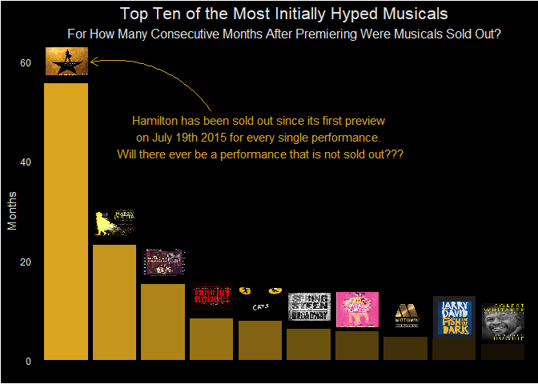

Untitled
================
Pascal Schmidt
April 27, 2020

``` r
library(tidyverse)
library(tidytuesdayR)
library(ggimage)
```

``` r
tuesdata <- tidytuesdayR::tt_load("2020-04-28")
gross <- tuesdata$grosses
head(gross)
```

    ## # A tibble: 6 x 14
    ##   week_ending week_number weekly_gross_ov~ show  theatre weekly_gross
    ##   <date>            <dbl>            <dbl> <chr> <chr>          <dbl>
    ## 1 1985-06-09            1          3915937 42nd~ St. Ja~       282368
    ## 2 1985-06-09            1          3915937 A Ch~ Sam S.~       222584
    ## 3 1985-06-09            1          3915937 Aren~ Brooks~       249272
    ## 4 1985-06-09            1          3915937 Arms~ Circle~        95688
    ## 5 1985-06-09            1          3915937 As Is Lyceum~        61059
    ## 6 1985-06-09            1          3915937 Big ~ Eugene~       255386
    ## # ... with 8 more variables: potential_gross <lgl>, avg_ticket_price <dbl>,
    ## #   top_ticket_price <lgl>, seats_sold <dbl>, seats_in_theatre <dbl>,
    ## #   pct_capacity <dbl>, performances <dbl>, previews <dbl>

``` r
gross %>%
  dplyr::group_split(show) %>%
  purrr::map(~ dplyr::arrange(., week_ending)) %>%
  purrr::map(~ purrr::head_while(.$pct_capacity, ~ . >= 1)) %>%
  purrr::map(~ length(.)) -> most_hyped

head(most_hyped)
```

    ## [[1]]
    ## [1] 0
    ## 
    ## [[2]]
    ## [1] 0
    ## 
    ## [[3]]
    ## [1] 0
    ## 
    ## [[4]]
    ## [1] 0
    ## 
    ## [[5]]
    ## [1] 0
    ## 
    ## [[6]]
    ## [1] 0

``` r
gross %>%
  dplyr::group_split(show) %>%
  purrr::map2(., most_hyped, ~ .x[1:.y, ]) %>%
  do.call(rbind, .) -> most_hyped

head(most_hyped)
```

    ## # A tibble: 6 x 14
    ##   week_ending week_number weekly_gross_ov~ show  theatre weekly_gross
    ##   <date>            <dbl>            <dbl> <chr> <chr>          <dbl>
    ## 1 2004-10-24           21         12484083 "'ni~ Royale~       125452
    ## 2 2003-05-11           50         13957866 "\"M~ Royale~       148824
    ## 3 2008-07-06            6         18880521 "[ti~ Lyceum~        69299
    ## 4 2007-04-15           46         22462312 "110~ Studio~       197785
    ## 5 2008-09-21           17         15646164 "13"  Bernar~       203326
    ## 6 1997-07-20            7          9449380 "177~ Gershw~       150045
    ## # ... with 8 more variables: potential_gross <lgl>, avg_ticket_price <dbl>,
    ## #   top_ticket_price <lgl>, seats_sold <dbl>, seats_in_theatre <dbl>,
    ## #   pct_capacity <dbl>, performances <dbl>, previews <dbl>

``` r
most_hyped %>%
  dplyr::count(show, sort = TRUE) %>%
  dplyr::arrange(desc(n)) %>%
  .[1:10, ] %>%
  dplyr::mutate(months = round(n / 52 * 12, 2)) -> top_ten

top_ten
```

    ## # A tibble: 10 x 3
    ##    show                                                     n months
    ##    <chr>                                                <int>  <dbl>
    ##  1 Hamilton                                               241  55.6 
    ##  2 Harry Potter and the Cursed Child, Parts One and Two   100  23.1 
    ##  3 To Kill A Mockingbird                                   66  15.2 
    ##  4 Moulin Rouge! The Musical!                              36   8.31
    ##  5 Cats                                                    34   7.85
    ##  6 Springsteen On Broadway                                 27   6.23
    ##  7 Mean Girls                                              25   5.77
    ##  8 Motown The Musical                                      20   4.62
    ##  9 Fish in the Dark                                        18   4.15
    ## 10 Hughie                                                  14   3.23

``` r
images <- list.files()[stringr::str_detect(list.files(), pattern = ".*png")]

path <- vector(mode = "character", length = nrow(top_ten))
for (i in 1:nrow(top_ten)) {
  index <- which(grepl(
    pattern = stringr::str_remove(images[i], "\\.png"),
    top_ten$show, ignore.case = TRUE
  ))
  path[index] <- images[i]
}

path <- paste0(here::here(), "/", path)

top_ten %>%
  dplyr::bind_cols(dplyr::as_tibble(path)) %>%
  dplyr::mutate(show = forcats::fct_reorder(show, n, .desc = TRUE)) -> top_ten

top_ten
```

    ## # A tibble: 10 x 4
    ##    show                             n months value                              
    ##    <fct>                        <int>  <dbl> <chr>                              
    ##  1 Hamilton                       241  55.6  C:/Users/Pascal Schmidt/Desktop/ti~
    ##  2 Harry Potter and the Cursed~   100  23.1  C:/Users/Pascal Schmidt/Desktop/ti~
    ##  3 To Kill A Mockingbird           66  15.2  C:/Users/Pascal Schmidt/Desktop/ti~
    ##  4 Moulin Rouge! The Musical!      36   8.31 C:/Users/Pascal Schmidt/Desktop/ti~
    ##  5 Cats                            34   7.85 C:/Users/Pascal Schmidt/Desktop/ti~
    ##  6 Springsteen On Broadway         27   6.23 C:/Users/Pascal Schmidt/Desktop/ti~
    ##  7 Mean Girls                      25   5.77 C:/Users/Pascal Schmidt/Desktop/ti~
    ##  8 Motown The Musical              20   4.62 C:/Users/Pascal Schmidt/Desktop/ti~
    ##  9 Fish in the Dark                18   4.15 C:/Users/Pascal Schmidt/Desktop/ti~
    ## 10 Hughie                          14   3.23 C:/Users/Pascal Schmidt/Desktop/ti~

``` r
top_ten %>%
  dplyr::mutate(alpha = c(1, 0.9, 0.8, 0.7, 0.6, 0.5, 0.4, 0.3, 0.2, 0.1)) -> top_ten


ggplot(top_ten, aes(x = show, y = months)) +
  geom_col(fill = "#DAA520", aes(alpha = alpha)) +
  geom_image(aes(image = value, y = months + 4.5), size = 0.085) +
  theme(
    panel.grid.major = element_blank(),
    panel.grid.minor = element_blank(),
    plot.background = element_rect(fill = "black"),
    panel.background = element_rect(fill = "black"),
    axis.title.x = element_blank(),
    axis.text.x = element_blank(),
    axis.ticks = element_blank(),
    axis.line = element_blank(),
    axis.text.y = element_text(color = "#e5e4e2"),
    axis.title.y = element_text(color = "#e5e4e2"),
    plot.subtitle = element_text(color = "#e5e4e2", hjust = 0.5, size = 12),
    plot.title = element_text(color = "#e5e4e2", hjust = 0.5, size = 16),
    legend.position = "none"
  ) +
  ylab("Months") +
  labs(
    title = "Top Ten of the Most Initially Hyped Musicals",
    subtitle = "For How Many Consecutive Months After Premiering Were Musicals Sold Out?"
  ) +
  annotate("curve", x = 4, y = 50, xend = 1.5, yend = 60, curvature = 0.3, arrow = arrow(length = unit(3, "mm")), color = "#DAA520") +
  annotate("text",
    x = 5,
    y = 45,
    label = "Hamilton has been sold out since its first preview \non July 19th 2015 for every single performance. \nWill there ever be a performance that is not sold out???",
    color = "#DAA520"
  )
```

<!-- -->

``` r
ggsave("final/broadway.jpeg", width = 10)
```
